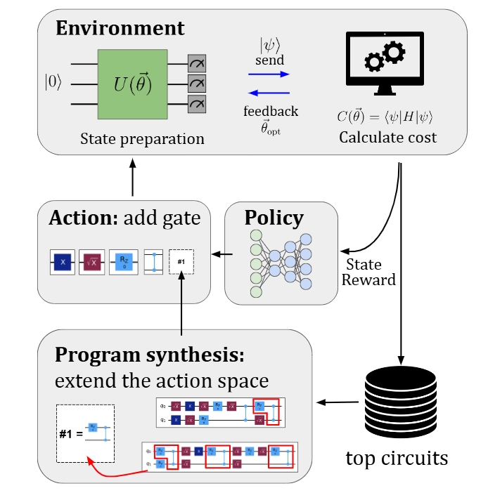

# Gadget Reinforcement Learning
 ## RL to solve easy problems -> extract useful gadgets -> leverage gadgetized RL to tackle hard problems

<div style="font-size: 20px;">



# Installing packages

```
conda create -n {name_your_environment} python=3.10
conda activate {name_your_environment}
pip install -r requirements.txt
```

# Running CRL and GRL

In the `gadget_RL`, we already have the codes prepared for `CRLQAS` [ICLR 2024](https://openreview.net/forum?id=rINBD8jPoP&noteId=CrB0JrEQJY) on the transverse field Ising model and `GRL` with 1 and 2 extracted gates.

## Configurations

Inside `gadget_RL` in the `configuration_file` folder, we have many possible configurations of the agent-environment parameters such as 

- Number of qubits
- Number of layers: defines the number of steps per episode
-  **decompose:**
    - **if 0:** we get to train the CRL under RX, RY, RZ and CX action space.
    - **if 1:** we get to train the CRL under the action space of IBM Torino hardware.

In the name of the configurations, if it contains `synthesized`, it should be used for `GRL` runs. Where `...synthesize_1` means GRL with one gadget and `...synthesize_2` corresponds to GRL with two gadgets.

## To run CRL without extracted gates
In order to run CRL without any gadgets: In the environment folder, the gadgetless environment is provided with `environment.py` to train in this folder you need to run `main.py` with the valid configuration.

For an example (for **RX, RY, RZ, CX** actions space):

```
python main.py --seed {experiment_seed} --config tfim_2q_j1_h1_nd --experiment_name "TFIM/"
```

runs `CRLQAS` on 2-qubit TFIM with **(RX, RY, RZ, CX)** gateset. 

Meanwhile (for **RZ, SX, X, CZ** action space):

```
python main.py --seed {experiment_seed} --config tfim_2q_j1_h1_hardware --experiment_name "TFIM/"
```
runs `CRLQAS` on 2-qubit TFIM with **(RZ, SX, X, CZ)** gateset of `IBM Torino`.


## Analysing saved circuits:

After training, the `results/` folder contains all the results. The corresponding folders start with the same name as the name in `configuration_files/`. The results are in the `summary_{experiment_seed}.pickle` which is a dictionary containing folloing variables:

- *loss:* The loss function of the agent
- *actions:* The action taken at each step
- *errors_noiseless:* The error in the noiseless environment
- *errors:* If noisy environment chosen these are noisy errors else `errors == errors_noiseless`
- *done_threshold:* The `curriculum learning` threshold
- *nfev:* Number of function evaluations by classical optimizer
- *opt_ang:* optimal angles of quantum circuits
- *time:* Time taken to finish each episode
- *save_circ:* Circuit saved each step 
- *rewards:* reward received each step

## Finding Gadgets

Here, we discuss how to discover gadgets automatically from the top $k$-circuits. In our case, top circuits are the ones which provide the best approximation to the ground energy of the TFIM. Please follow the steps mentioned below:

- Go to folder `discover_gadgets`.
- Run:
    ```
    python run_decomposition.py
    ```

The script `run_decomposition.py` is interactive and should be self-explanatory. You can also find *gadgets* from very simple toy circuits

```
──RX(θ)───■──
          │
──────────X──

──RX(θ)──■───RZ(θ)──RX(θ)───■─
         │                  │
─────────X──────────────────X─
```

which are saved in the folder `discover_gadgets/example_circuits_to_synthesize/best_circuits/circ_list_for_testing_synthesis.pickle`.


## Training with gadgets

To train GRL with just 1 gadget on 2-qubit TFIM:
```
main_synthesized_1.py --seed {experiment_seed} --config tfim_2q_j1_h1_synthesized_1 --experiment_name "TFIM/"
```

The gadget under consideration is:
```
──X──SX──
```

To train GRL with 2 extracted gadgets on 2-qubit TFIM:
```
main_synthesized_2.py --seed {experiment_seed} --config tfim_2q_j1_h1_synthesized_2 --experiment_name "TFIM/"
```
here, the additional gadget is:
```
──RZ(θ)───■──
          │
──────────■──
```
